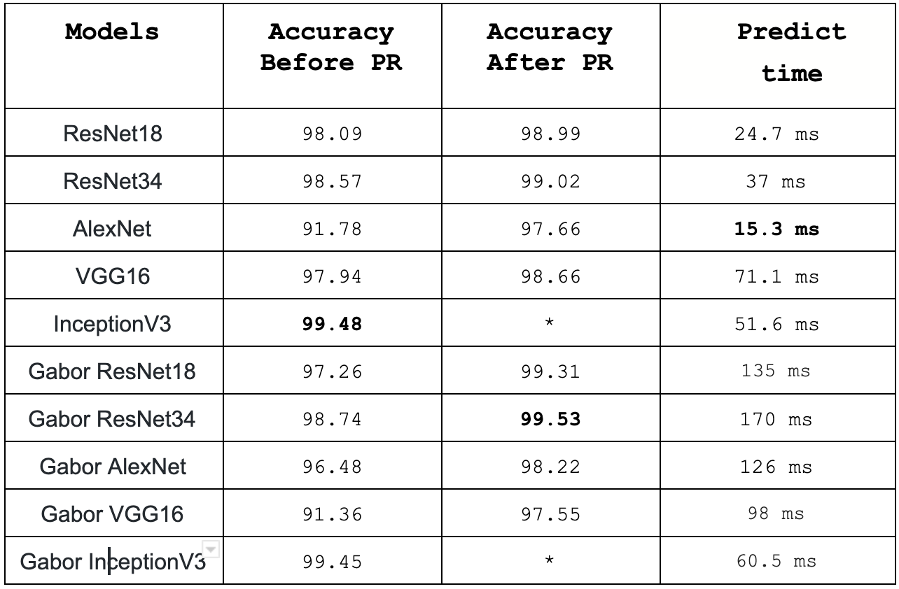

#                PlantIll

Mobile application for plant disease recognition using a deep learning model 
 
## About :

This project is two parts :

 - Deep learning part: we did train a model for plant disease recognition, You can find the work under the folder /DPModel, more explanation below (Dataset, Weights, Training).
    
 - Mobile dev part: We build this part using Flutter.

# 1-Deep Learning Model

## Dataset: 

  -  The dataset we worked with contains 39 classes, The healthy plants are apart of these classes, there is also Background
  class, it refers to the images where there is no plant or plants which those not exist in our classes.
  
  - The link for the data is [here](https://drive.google.com/file/d/0B_voCy5O5sXMTFByemhpZllYREU/view?usp=sharing), a special thanks to Marko Arsenovic who provided this dataset.
  

  - The link for the weights we got after training [here](https://drive.google.com/drive/folders/1-5S1v6ydXjdHfUaBWsoXkO8v7vqegCIY?usp=sharing).
  
## The Models we used :
    
This the models we did train:

  - ResNet18
  - AlexNet
  - VGG16
  - IceptionV3
  - ResNet34

## The training:

All the models were trained to respect the following steps : 
  - step 1 :
  We did transfer learning for the model, the last layer was trained on 39 classes. At the beggining we choose the image size to be 128 so we will be able to do progressive resizing later on.

  - step 2 : 
  we unfreeze all the layers of the model and we train it again. 

  - step 3 :
  we do the progressive resizing so we change the size of the image from 128 to the original size which is 265, then we unfreeze just the last two layers of the model and we train it.

  - step 4 :
  we unfreeze the last three layers of the model and we train it.

  - last step : 
  we unfreeze all the model and we train it.
          
## The results:

The following table shows 

## Deployment of the best model :
  "TODO  how you did your deployment "
 

          
          
# 2-Mobile Dev part 
